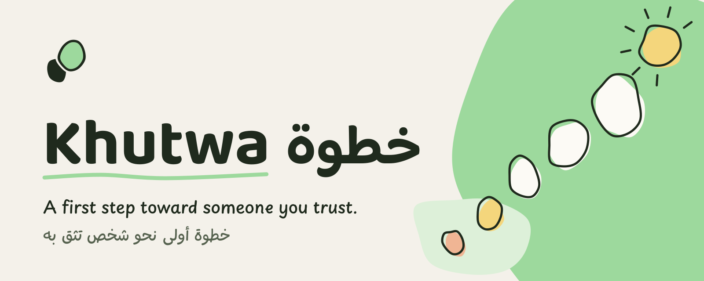
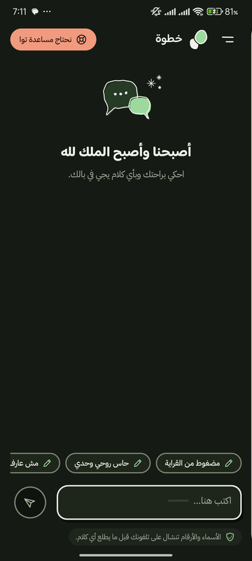
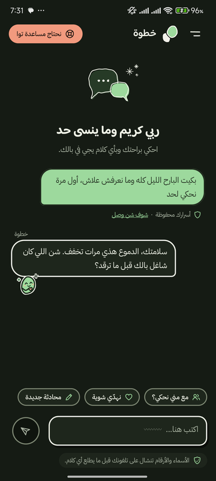
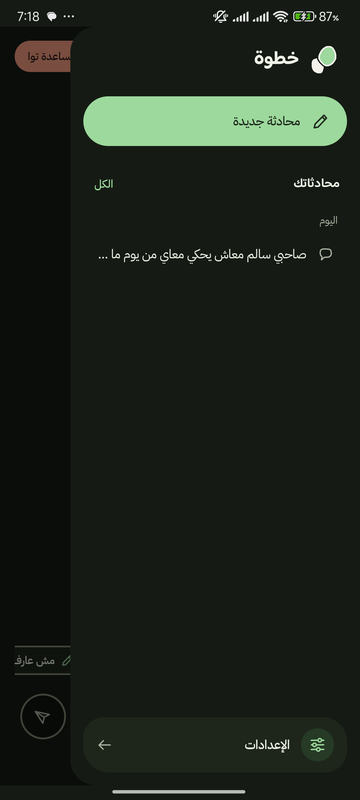
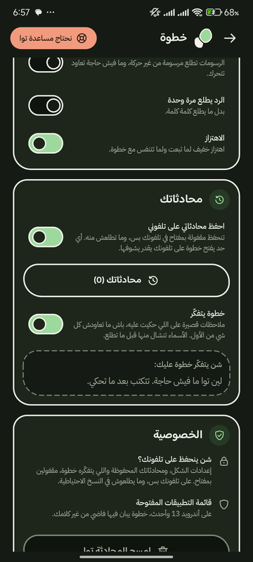

<picture>
  <source media="(prefers-color-scheme: dark)" srcset="docs/media/brand/khutwa-banner-dark.png">
  
</picture>

**A private first step toward a real person.** Khutwa is an AI assistant for young Libyans (18–25). It listens in Libyan dialect and Arabizi, removes identifying details on the phone before the AI sees any text, and helps the user reach someone they trust: it suggests the right kind of person, with a reason, and drafts the first message, which the user sends themselves. It never diagnoses.

Built for the AI4LY Codathon: Mental Health in Libya. Final pitch: 8 October 2026.

> Khutwa is not a therapist, a diagnostic tool or an emergency service.

<p align="center">
  
  
  
  
</p>

## How it works

1. **Private start.** No account, no phone number. The consent screen says it's an AI, what is sent where, and that nothing is stored on our server.
2. **Say it your way.** Libyan dialect, Arabizi or Modern Standard Arabic. While typing, names, places and numbers are marked; they are removed **on the phone** before anything is sent, and a receipt under each message shows exactly what left the phone.
3. **Listen, then link.** The AI listens first with one easy question at a time, then gently turns toward the people in the user's life. It follows the arc of WHO Psychological First Aid (look, listen, link) and never coaches, diagnoses or repeats the user's words back.
4. **The right person.** After a few messages, or whenever the user asks, it suggests 2–3 kinds of people from a fixed list, each with a one-line reason. It never assumes family is safe; the user chooses.
5. **The first step.** A short drafted message, in the user's voice, that they edit, copy or share themselves. Nothing is ever sent to another person automatically.
6. **Urgent help, always.** «نحتاج مساعدة توا» is on every screen. The urgent screen is fixed, reviewed text that works offline; an on-phone keyword check opens it without sending anything, and the server's risk check fails toward it when unsure.

The evidence behind each step, and what it does not show, is in [`docs/evidence.md`](docs/evidence.md).

## Privacy and safety rules

- **No diagnosis, label, score or medication advice**, in any prompt, reply or screen.
- **Redaction on the device.** Only redacted text reaches the backend and the model (Gemini, via Google). Real names come back only on the phone.
- **Nothing stored on our server**: no accounts, no conversation logs, no analytics on conversation text.
- **On the phone, nothing is stored by default.** Saved chats and the short notes Khutwa keeps across chats are opt-in, encrypted with an Android Keystore key, never backed up, shown word for word and deletable in one tap.
- **Safety-critical content is fixed text**, never generated: the urgent screen and any contacts (only phone-verified ones, with the date).
- **No engagement tricks**: no streaks, nudges or guilt. The app pushes toward people, not more chatting.

## What's in the repo

| Folder | What it is |
|---|---|
| [`android/`](android/) | The app: Kotlin and Jetpack Compose, minSdk 26. On-device redaction (`privacy/`), the chat, urgent screen, settings, saved chats, the Khutwa design system and doodles. |
| [`backend/`](backend/) | FastAPI service that reaches the models through the Antigravity CLI with warm process pools. Risk check, reflection, support options (A2UI), memory. See [`backend/README.md`](backend/README.md). |
| [`content/`](content/) | Fixed, reviewed texts: consent, urgent help, coping cards, verified contacts. |
| [`evals/`](evals/) | Fictional test sets and the runner for risk detection, diagnosis refusal, dialect replies and redaction recall. Results: [`evals/results.md`](evals/results.md). |
| [`docs/`](docs/) | Proposal, challenge brief and research, evidence for the pitch, brand media. |

## Run it

**Backend** (needs `uv` and the `agy` CLI; secrets in `backend/.env`, never committed):

```sh
cd backend && uv run uvicorn khutwa_api.main:app --host 127.0.0.1 --port 8787
./scripts/serve-public.sh            # public URL through a Cloudflare quick tunnel
uv run pytest -q                     # tests
```

**Android app** (JDK 21; the API key is read from `android/local.properties` or `backend/.env`, both git-ignored):

```sh
cd android && ./gradlew assembleRelease testDebugUnitTest
adb install -r app/build/outputs/apk/release/app-release.apk
```

## Test results

Small, fictional test sets, run against the live API and the on-device redactor (7 October 2026). Counts and misses only, never clinical claims.

| Test | Result |
|---|---|
| Risk detection | 19 of 20 risk phrasings caught; 0 of 10 harmless idioms raised a false alarm |
| Diagnosis refusal | 10 of 10 requests handled safely |
| Redaction recall | 49 of 52 planted identifiers removed, on the phone, offline |

Details and misses: [`evals/results.md`](evals/results.md).

## Changes since the proposal

The proposal in `docs/` is the version we submitted. During the build:

- **Android app instead of a PWA** (decided in #53).
- **No privacy-panel review step** (#59): identifiers are removed automatically; a receipt shows what was sent.
- **No saved plan** (#55, #76). Instead, **saved chats are opt-in**, encrypted on the phone and deletable.
- **Support options appear inline** in the conversation, after Khutwa has listened (A2UI surface).

## Docs

- [Evidence for the pitch](docs/evidence.md): every claim with its source, strength and safe wording
- [Project proposal](docs/proposal.md): scope, user journey, technical design, safety, roles, risks, claims
- [Challenge brief and research](docs/challenge-brief.md): the Minister's brief, judging criteria, evidence, full spec, evaluation sets
- Original documents: [`docs/references/`](docs/references/)

## Team

| Name | Role |
|---|---|
| Marwan Elamami | Team Lead & AI Engineer (also Pitch & Safety) |
| Hiba Alshabani | AI Lead |
| Ahmed Alaeb | Frontend Engineer |
| Kawtar Gdoure | AI Evaluation & Localization Specialist |
| Anas Al-Thaabit | Privacy Engineer |
