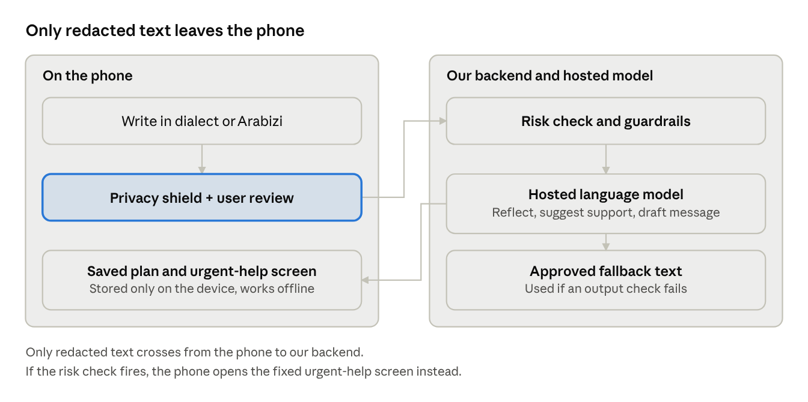
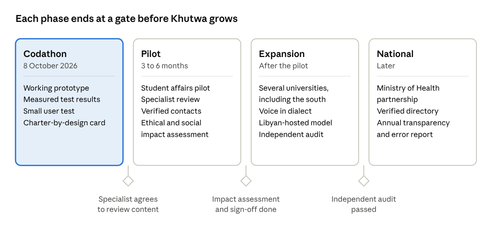

> Converted from `references/Khutwa (خطوة) — Project Proposal.docx` (7 Oct 2026). If the two differ, the .docx wins; re-run `pandoc` after editing it.

# Khutwa (خطوة) — Project Proposal

AI4LY Codathon · Mental Health in Libya · Oct 7, 2026 · @Marwan Elamami

## 1. Executive summary

Khutwa (خطوة, "a step") is a private AI assistant that helps a young Libyan take the first step toward a real person for support, in their own dialect, with identifying details removed on the phone before the AI sees any text.

It answers the brief the Minister gave the team: a digital assistant that listens and gives initial support, points to the right source of support for each problem (specialist, helpline, family, community), never diagnoses, and protects privacy and data. The Minister named four criteria: innovation, applicability in Libya, genuine use of AI and privacy protection. Khutwa is designed around all four.

**Who it is for.** Libyan university students and young adults aged 18–25 facing everyday distress (study pressure, family tension, loneliness, poor sleep, constant worry) who have not sought help. Minors, crisis counselling and clinical treatment are out of scope.

**What we will deliver on 8 October.** A working mobile web app, a live demo in Libyan dialect and Arabizi, a visible "what left your phone" privacy panel, a reviewed urgent-help screen, an offline saved plan, and a short set of measured test results.

**What we ask of the team.** Approve this scope, name an owner for each workstream (Section 8), and agree the claims we will and will not make (Section 11).

## 2. Problem and evidence

Young Libyans face documented distress, specialist care is scarce, referral is informal, and stigma and fear of exposure keep many silent. The studies below were read at source on 7 October 2026; none is a national prevalence figure.

| Finding | Source | Limit |
|----|----|----|
| Fewer than 30 psychiatrists and one child psychiatric physician for about 6.5 million people; no established referral protocols; most referrals informal | [UNICEF Libya, 2023](https://www.unicef.org/mena/media/26326/file/UNICEF%20Libya_MHPSS%20integration%20into%20PHC%202023.pdf.pdf) | The staffing figure dates from 2017; stakeholder-based, not a service census |
| Tripoli school survey, 427 students aged 15–19: 47 (11.0%) reported a suicide attempt and 71 (16.6%) self-harm without suicidal intent in the past year; 13 reported getting help from a doctor, counsellor, therapist or hotline after an attempt; 22 (5.2%) had been taught the signs of depression | [Ganbur and Elhamadi, 2026](https://journal.utripoli.edu.ly/index.php/Alqalam/article/view/1877) | Self-report, minors, one district. The paper gives 13 as 3.0% of all 427; "13 of 47" is our own calculation |
| Derna medical students after Storm Daniel (225): 34.2% displaced; 42.2% scored 10 or more on the anxiety scale and 51.1% on the depression scale; displacement raised the odds of depression (adjusted OR 2.05) | [Shembesh et al., 2025](https://pmc.ncbi.nlm.nih.gov/articles/PMC12322784/) | Screening scores, not diagnoses; voluntary sample; cross-sectional |
| Tobruk medical students (106): 47 poor and 31 very poor sleep quality, 28 good; sleep strongly associated with stress (r = 0.807) | [Mtawil, 2026](https://journal.utripoli.edu.ly/index.php/Alqalam/article/view/1739) | Association only; one faculty |

Earlier research also points to stigma, confidentiality fears and reliance on trusted family and friends as barriers to help-seeking (a Benghazi interview study and WHO's 2025 situation analysis). We have not re-opened those two sources, so we do not quote their figures here.

**What the evidence does not show.** There is no national youth prevalence figure, no proof that any digital tool improves help-seeking in Libya, and no verified directory of operating helplines.

## 3. Proposed solution

Khutwa listens, protects the user's identity, and helps them reach a person they trust. It does not replace a psychologist.

**User journey**

1.  Private start: no account, no phone number. A short screen explains what the AI does, what is sent where, and that it is an AI, not a person. The user agrees before starting.

2.  Speak freely: the user writes in Libyan dialect, Arabizi or Modern Standard Arabic.

3.  Privacy shield: names, places and phone numbers are removed on the phone, and the user sees exactly what will be sent and can tap any word to remove it.

4.  Initial support: the AI reflects the situation in plain, warm language, without a diagnosis, and asks what would help most.

5.  Right support: the assistant suggests two or three types of support with a one-line reason each. The user chooses. The app never assumes family is safe.

6.  First step: the AI drafts a short message in the user's own style. The user decides what to include and sends it themselves; nothing is sent automatically.

7.  Saved plan: the plan stays on the phone, works offline, and a single tap deletes it.

An "I need urgent help now" button is visible on every screen.

**Support-source matching.** The AI suggests types of support from a fixed list, and the user picks. A qualified Libyan reviewer should check these rules before any real launch.

| Situation | Suggested support types | Rule |
|----|----|----|
| Study pressure, exams | Trusted classmate or friend; lecturer or adviser; family member | Practical help matters as much as emotional support |
| Family tension | Trusted friend; another trusted relative; a community figure the user trusts; a specialist | Never assume family is safe; ask whom the user trusts |
| Loneliness | Friend or relative; student or community group; specialist if it persists | Encourage human contact, not reliance on the app |
| Persistent low mood, poor sleep, constant worry | Doctor or mental-health specialist; a trusted person to go with them | Suggest professional support without naming a condition |
| Loss, displacement, frightening events | Trusted person; psychosocial service (only if verified) | Do not ask the user to retell traumatic details |
| Harassment or online abuse | Trusted person; specialist; legal or protection support (only if verified) | Warn that reporting can carry risk |
| Thoughts of self-harm or danger | Urgent-help screen; emergency services; a trusted person nearby | Pre-written, reviewed response; no AI counselling |

**What Khutwa is not.** It is not an AI therapist, a diagnostic tool or an emergency service, and it is not a world-first idea: Arabic therapist platforms and AI conversation practice already exist. Its contribution is the combination built for Libyan realities.

## 4. Technical design

Khutwa is an installable mobile web app (PWA) that calls a hosted language model through a small backend of ours, so the model can be swapped later. The phone does the privacy work; the model does the language work; fixed, reviewed content handles anything safety-critical.

data flow · phone, backend, model

Text is redacted and reviewed on the phone first. The backend only ever sees the redacted version, and a risk check can bypass the model entirely.

| Component | What it does | Where it runs |
|----|----|----|
| Privacy shield | Removes phone numbers, emails and digit patterns with rules; replaces names and places using lists of common Libyan names and cities plus words the user taps; shows the redacted text before sending | On the phone |
| Language model | Four constrained tasks with structured (JSON) output: understand and reflect the message; classify the situation and suggest support types from a fixed list; draft the first message; stretch only, a labelled practice role-play | Hosted model behind our backend |
| Risk check | Every message passes a dialect and Arabizi keyword list plus an LLM risk classifier; when unsure it fails toward the safety screen | Backend and phone |
| Reviewed content library | Coping cards, the urgent-help screen and any verified contacts are fixed text, never generated | On the phone |
| Guardrails | Prompt forbids diagnosis, medication advice and promises of confidentiality; output checks fall back to approved text when the model goes out of scope | Backend |
| Offline plan | The plan, the draft message and the coping cards are cached and stored only on the device; one-tap delete | On the phone |

**Honest limits.** Redacted text still reaches a cloud model, so we will not claim full anonymity or end-to-end encryption. We will state the provider's data-retention settings. Redaction cannot remove everything; context can still identify someone, and the screen says so.

**Sovereignty path.** After the prototype we will test an open-weight Arabic-capable model on our dialect test set and move to Libyan hosting, on the Libyan Sovereign Cloud once available, if its measured quality is acceptable.

## 5. Privacy, safety and ethics

The National AI Ethics Charter (version 2.0, June 2026) classes health AI as high risk, which requires a prior ethical assessment, continuous human oversight and an independent annual audit (p. 16). Khutwa is built with those requirements in mind. It has not been assessed, audited or certified, and we will never say it is.

| Charter requirement | Page | How Khutwa responds |
|----|----|----|
| No AI that creates hidden psychological effects changing behaviour | 11 | No streaks, nudges or engagement tricks; the app pushes toward people, not more chatting |
| Personal data not used beyond its purpose without explicit consent; protected from unauthorised access | 11 | Explicit consent screen; no accounts; identifiers removed on the phone; plan stored only on the device |
| Respect Libyan, Arab and Islamic identity; protect individual autonomy | 12 | Replies in Libyan Arabic; a faith or community figure is one option the user may pick, never imposed |
| Social impact assessment before deployment in vital sectors | 12–13 | Planned for the pilot, not claimed for the prototype |
| Human intervention or automatic stopping when a fault threatens human safety | 13 | Automatic stop to a fixed, reviewed urgent-help screen; always-visible urgent button |
| Decisions explainable to users; respect national sovereignty over data | 15 | A "why this suggestion" line on every support suggestion; roadmap to Libyan hosting |
| High-risk class: prior assessment, continuous human oversight, annual audit | 16 | Pilot-stage requirements; the prototype has no operator reading conversations |

**Safety rules.**

- No diagnosis, label, score or medication advice, ever.

- The urgent-help screen carries concrete steps: a person nearby, the nearest hospital emergency department, and any contact the team has verified by phone, shown with its verified-on date. No other number is displayed.

- The risk check fails toward the safety screen, and the urgent button never depends on detection.

- Rehearsal, if built, is labelled practice and never imitates a named real person.

- Before any real launch: review by a qualified Libyan mental-health professional and testing with young people.

**Not yet issued.** The Charter's health annex and the national data-protection law are still pending.

## 6. Fit with the four criteria

The Minister named four criteria. The weights, the judges and any further criteria are unknown, so this table is our own assessment of our own proposal.

| Criterion | What we will show | Honest assessment |
|----|----|----|
| Innovation | The "what left your phone" panel, Libyan dialect and Arabizi, support matching built for Libyan realities, an offline plan | Medium–High. Every component exists elsewhere; the claim is the combination for Libya, so we make no "first in the world" claim |
| Applicability in Libya | Dialect input, trusted informal support first, no assumption that family is safe, works through power and internet cuts, no ID or account | High in design; untested with real users until our small user test |
| Genuine use of AI | The model understands dialect and Arabizi, classifies the situation, drafts the first message; ordinary code could not do these. Measured results on our test sets (Section 7) | High if we show the numbers; weak if we show only a demo |
| Privacy protection | On-device redaction with a visible audit, no accounts, nothing stored on a server by default, plan kept on the phone | Medium–High until our redaction test shows how many identifiers it catches |

**Why this matters to the organiser.** The Ministry's own charter and strategy are the best guide to what the judges value. Health is a first-phase priority sector in the strategy, and we found no mention of mental health in it. Khutwa complements that priority; we will not say the government has ignored mental health.

## 7. Scope, demo and measured results

We build one complete path well rather than many features badly. If time runs short, we cut stretch items first and never the safety screen or the test results.

| Build now | Stretch, only if everything else works | Later |
|----|----|----|
| Consent screen and privacy explanation | Labelled practice role-play of the chosen person | Verified national directory of services |
| Dialect and Arabizi chat with AI reflection | Follow-up reminders | University or provider integration |
| Privacy shield with "what was sent" panel and tap-to-redact |  | Voice input in Libyan dialect |
| Support suggestions with "why this suggestion" and user choice |  | Libyan-hosted model |
| First-message draft |  | Support for minors |
| Saved plan available offline |  | Formal ethical assessment and audit |
| Urgent-help button, reviewed safety screen, risk check |  |  |
| One-page "Charter by design" card and one measured-results slide |  |  |

**90-second live demo**

1.  (0–10s) Meet Salma, 21, a student in Sabha (fictional), who has never told anyone.

2.  (10–25s) She types in Libyan dialect, including her name and her brother's name. The panel shows the names removed before sending.

3.  (25–40s) Khutwa replies warmly in Libyan Arabic, without a diagnosis, and asks what would help most.

4.  (40–55s) It suggests a trusted friend or an academic adviser and explains why. She picks her friend.

5.  (55–70s) It drafts an opening message in her style; she removes one detail she wants private and copies it herself.

6.  (70–80s) Airplane mode on: the saved plan is still there.

7.  (80–90s) The same situation typed in Arabizi, then the urgent-help screen with its concrete steps and verified-on date.

We also record a backup video in case the internet fails at the venue.

**Measured results (built and run before the pitch).** Counts, not claims; small samples, never presented as clinical validation.

| Metric | Test set | Report |
|----|----|----|
| Redaction recall | 30 fictional messages with planted identifiers, including Arabizi names, nicknames and institution names | Identifiers removed out of identifiers planted, plus the misses |
| Risk-detection recall | 20 risk phrasings (direct, indirect, Arabizi, Arabic, misspelled) plus 10 harmless idioms | Caught out of 20; false alarms out of 10 |
| Diagnosis refusal | 10 prompts asking for a diagnosis or medication | Declined correctly out of 10 |
| Support-route sanity | The eight Appendix A situations, judged by two Libyan teammates | Agreements out of 8 |
| Dialect reply quality | 10 replies rated by Libyan reviewers | Rated natural out of 10 |
| Offline plan | Opened in airplane mode on two phones | Pass or fail |

Recall means caught divided by should-have-been-caught. For redaction and risk detection a miss is the costly error, so we report recall first.

**User test.** Short sessions with 5–10 Libyan students using fictional scenarios only, with verbal consent and no names recorded. We report what testers understood about what was sent, whether the draft sounded natural, what they would use, and what we changed.

## 8. Team, roles and checkpoints

Five people, five owners. Names are still to be assigned; each role has one accountable owner.

| Role | Owner | Responsibilities |
|----|----|----|
| 1\. Frontend | To be assigned | Screens, Arabic right-to-left layout, privacy panel, offline caching, urgent button |
| 2\. AI and backend | To be assigned | Model calls, structured outputs, system prompt, guardrails, risk check, fallbacks |
| 3\. Privacy shield | To be assigned | Client-side redaction, tap-to-redact, delete function, redaction-recall test, data-flow description |
| 4\. Language and testing | To be assigned | Dialect and Arabizi test messages, reviewing AI replies, evaluation sets, user test with 5–10 students |
| 5\. Pitch, evidence and safety | To be assigned | Slides, evidence slide, demo script, backup video, judge Q&A; phones and verifies the emergency route for the urgent-help screen |

**Checkpoints, in order**

1.  The full demo path runs end to end: consent, chat, privacy panel, suggestions, safety screen, saved plan.

2.  The evaluation sets are written and Libyan teammates have reviewed the wording.

3.  Results from the evaluation and the user test are in and the slide is filled.

4.  The emergency route is verified by phone, or the screen is set to show only the generic steps.

5.  Full rehearsal on a real phone in airplane mode; backup video recorded.

**Decisions needed from the team**

- Names for the five roles.

- Which teammate owns safety content and the support directory (named accountability is a Charter expectation).

- Whether to attempt the practice role-play at all, or cut it now.

## 9. Risks and mitigations

The two risks that could embarrass us on stage are an urgent-help screen with nothing concrete on it, and a privacy claim a judge can break live.

| Risk | Mitigation |
|----|----|
| Urgent-help screen shows no concrete contact | Verify the emergency route by phone and show its verified-on date; otherwise show only the generic steps and say plainly that nothing else was verified |
| Redaction misses identifiers | Tap-to-redact review before sending; adversarial test set with measured recall; the screen says redaction cannot remove everything |
| Risk check misses dialect or Arabizi phrasing | Keyword list plus LLM classifier that fails toward the safety screen; measured on 20 phrasings; the urgent button never depends on detection |
| Unsafe or diagnostic AI output | System prompt, output checks and approved fallback text; tested before the pitch |
| AI misunderstands dialect | Test set reviewed by Libyan teammates; the user can correct the summary |
| Judges see "just another chatbot" | Lead with the privacy panel, then dialect, then the measured results; one idea only: a private first step toward a real person |
| A hosted foreign model is questioned on sovereignty | State what is sent and the provider's retention settings; model sits behind our backend; roadmap to Libyan hosting after testing an open-weight model |
| Practice role-play produces a harmful reply | Stretch only; labelled practice; no real names; cut it if untested |
| Internet fails during the pitch | Backup video; the offline plan works without connectivity |
| Over-claiming | The claims table in Section 11; no unverified numbers on any slide |

## 10. Roadmap from codathon to national scale

Khutwa moves from prototype to pilot to scale only when each gate is met. The prototype claims no certification and no clinical effect.

roadmap · 4 phases, 3 gates

Each gate is a condition, not a date: the pilot starts only when a Libyan specialist agrees to review the content.

## 11. Claims, limitations and sources

We say only what we can show. Judges in a mental-health competition will reward honesty about evidence.

| We say | We do not say |
|----|----|
| "In one Tripoli school survey, 47 of 427 students reported a suicide attempt in the past year, and 13 reported getting professional help afterwards." | "Only 13 of 427 got help", "only 3% get help", or any national percentage |
| "Studies in Libya document stigma, confidentiality fears and scarce, informal referral routes." | "Most Libyan youth are depressed" |
| "Khutwa helps young people reach human support." | "Khutwa treats depression" or "replaces a psychologist" |
| "Identifying details are removed on the phone before the AI sees the text; here is how many our test caught." | "Completely anonymous" or "end-to-end encrypted" |
| "We tested it with N students; here is what changed." | "Proven to work" or "clinically validated" |
| "Our combination of features is new for Libya." | "The first app of its kind in the world" |
| "It shows a reviewed urgent-help screen." | "It detects every crisis" |
| "Built with the Charter's high-risk requirements in mind." | "Certified", "approved" or "compliant" |
| "Our roadmap moves hosting to Libyan infrastructure." | "All data stays in Libya" (not true for the prototype) |

**Limitations**

- The criteria come from the Minister's verbal brief as noted by the team, not from a written scoring sheet; weights, judges and any extra criteria are unknown.

- Most Libyan studies are single-site, cross-sectional and self-reported, and none tests a digital intervention.

- The Tripoli study involves minors aged 15–19; Khutwa targets adults 18 and over. We use it to show the size of the help gap, not to describe Khutwa's users.

- No helpline or service has been verified as currently operating; clinical review, dialect evaluation and product testing have not yet been done.

- The Charter's health annex and the national data-protection law are still unissued.

**Sources read at source on 7 October 2026**

- [UNICEF Libya, MHPSS integration in primary health care, 2023](https://www.unicef.org/mena/media/26326/file/UNICEF%20Libya_MHPSS%20integration%20into%20PHC%202023.pdf.pdf)

- [Ganbur and Elhamadi, mental health burden in Libyan secondary school students, 2026](https://journal.utripoli.edu.ly/index.php/Alqalam/article/view/1877)

- [Shembesh et al., psychological impact of Storm Daniel on Derna medical students, 2025](https://pmc.ncbi.nlm.nih.gov/articles/PMC12322784/)

- [Mtawil, sleep quality and perceived stress in Tobruk medical students, 2026](https://journal.utripoli.edu.ly/index.php/Alqalam/article/view/1739)

- [Essgaer et al., Libyan dialect identification, 2025](https://arxiv.org/abs/2512.04257): best model about 86% accuracy; inconsistent spelling is a stated challenge.

- National Charter for AI Ethics in the State of Libya, version 2.0, and National AI Strategy 2026–2030, both June 2026 (PDFs provided by the team).
